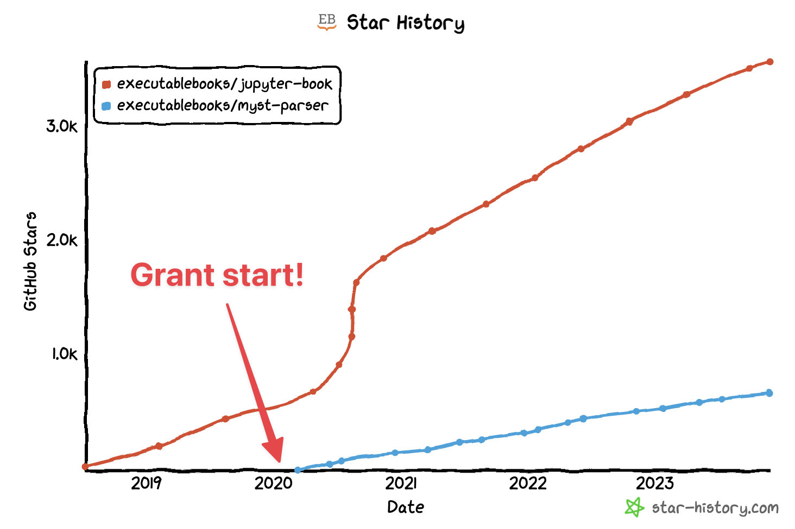

# Expanding our team and the next phase of Executable Books development

```{post} 2023-11-28
:author: Chris Holdgraf
:image: 1
:excerpt: 2
```

Over the past three years, the Executable Books team has focused its efforts on building a Sphinx-based technical stack underlying the Jupyter Book project. This has been extremely successful, and Jupyter Book and the associated MyST ecosystem in Sphinx have gained adoption across both scientific and open source communities. The MyST Parser for Sphinx averages around 350,000 downloads a month, which makes up about 13% of all Sphinx downloads ([https://www.pepy.tech/projects/myst-parser?versions=*](https://www.pepy.tech/projects/myst-parser?versions=*)). There are over 4000 Jupyter Book’s in public GitHub repositories ([https://github.com/search?q=%22format%3A+jb-book%22&type=code](https://github.com/search?q=%22format%3A+jb-book%22&type=code)), many of which are now featured at [gallery.executablebooks.org](https://executablebooks.org/en/latest/gallery/).



Earlier this year, we shared some [exciting new work in the Javascript stack of the MyST ecosystem](https://executablebooks.org/en/latest/blog/2023-02-09-announce-mystjs/). This aims to bring the entire Executable Books stack into a more modern technical foundation, create a more sustainable and scalable community of development, and unlock new workflows in communicating with computational narratives, especially in scientific publishing.

Over the past year we’ve continued to push this effort forward, and are excited to announce a few personnel changes to the project’s grant team in order to advance this effort further.


## Rowan Cockett is joining the Executable Books steering council

The Executable Books steering council has elected Rowan Cockett to join [our Steering Council](https://compass.executablebooks.org/en/latest/team/index.html#steering-council). Rowan will be the project’s first Steerco member that is not a Principle Investigator on the project’s original grant. Rowan brings expertise in modern web-based technology for scientific communication and computational narratives. He has made extensive contributions to the project over the past several years, and has led several major strategic efforts in defining new directions for our technical stack. He has also been an excellent collaborator and has exemplified our values of building an inclusive and participatory development culture. We’re excited to work with Rowan on the Steering Council, and look forward to his leadership in moving the project forward.


## Angus Hollands is joining the 2i2c team

We’re also pleased to announce that Angus Hollands will spend the next year dedicating his time to development and community management within the Executable Books project. He’ll do so via a new position with [2i2c](https://2i2c.org), one of the collaborating organizations represented on the Executable Books steering council. We'll use the final remaining funds in the project's grant to fund Angus' time.

Angus will focus his efforts on three key areas of the Executable Books ecosystem:

**Technical parity with Sphinx.** We wish to explore using MyST’s documentation engine as a back-end for Jupyter Book. As part of this, Angus will aim to bring MyST’s engine up to parity with the major functionality of Jupyter Book’s current implementation with Sphinx.

**User community adoption.** As part of this effort, Angus will work with key user communities to adopt the MyST documentation back-end, make any necessary changes to their content to utilize the new MyST backend, and identify friction points that can be resolved with documentation or development.

**Developer community growth.** Finally, Angus will work with other Steering Council and project members to lay a foundation for the Executable Books _organization_ moving forward, including identifying a fiscal home for the project and developing our initial contributing policies and guidelines as we begin opening up the project for formal participation from the broader community.

We hope that this gives a picture of the progress that we’ve made in the last few years, where our project stands now, and where we are deploying the final resources of our grant in pursuit of our goals to create open tools for communicating computational narratives. We’re excited to have Rowan and Angus joining the team in a formal capacity, and look forward to the great work that they’ll do.